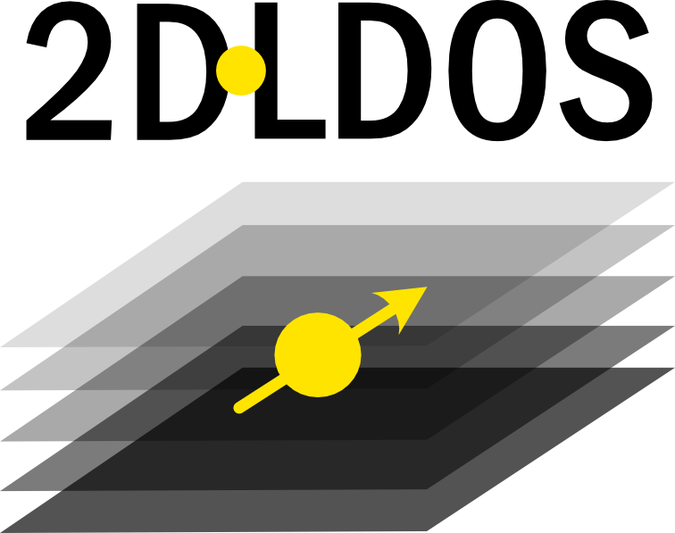
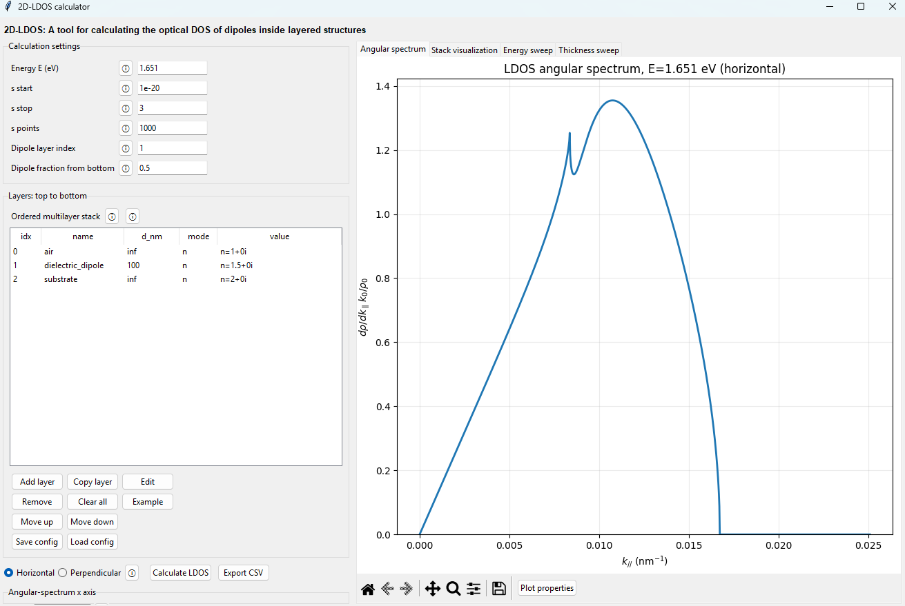

# 2D-LDOS
<p align="center">
  
</p>

<h1 align="center">2D-LDOS</h1>

<p align="center">
  Optical local density of states in planar multilayer structures
</p>
**2D-LDOS** is a standalone Python/Tkinter application for calculating the optical local density of states (LDOS) of electric dipoles embedded in planar multilayer structures.

The program builds arbitrary layered stacks, evaluates orientation-resolved LDOS angular spectra using generalized Fresnel reflection coefficients, and provides energy- and thickness-dependent sweeps. Sweep results can also be visualized as two-dimensional LDOS maps in energy/thickness versus in-plane wavevector.

## Features

- Arbitrary planar multilayer stacks
- Horizontal and perpendicular electric-dipole orientations
- Angular LDOS spectra
- Vacuum-normalized in-plane wavevector
  \[
  s = k_\parallel/k_0
  \]
- Display in either `s` or physical \(k_\parallel\)
- Energy sweeps
- Layer-thickness sweeps
- 2D energy–\(k\) and thickness–\(k\) LDOS maps
- Interactive Matplotlib plot properties, including axis limits/scales and 2D-map color limits/normalization
- Stack visualization and dipole-position display
- Constant refractive index \(n\), constant dielectric function \(\varepsilon\), or tabulated material data
- Material files based on energy or wavelength
- CSV export of LDOS spectra and sweep data
- JSON save/load for calculation configurations

## Screenshot

<p align="center">
  
</p>

## Requirements

- Python 3.10 or newer
- NumPy
- Matplotlib
- Tkinter

Tkinter is part of many standard Python installations, but on some Linux distributions it must be installed separately through the operating system.

## Installation

Clone the repository:

```bash
git clone <YOUR-REPOSITORY-URL>
cd 2D-LDOS
```

Install the Python dependencies:

```bash
python -m pip install -r requirements.txt
```

On Ubuntu/Debian, if Tkinter is missing:

```bash
sudo apt install python3-tk
```

## Running the application

```bash
python 2D_LDOS.py
```

The application opens with a generic lossless demonstration stack:

| Layer | Optical property | Thickness |
|---|---:|---:|
| Air | \(n=1.0\) | semi-infinite |
| Dielectric dipole layer | \(n=1.5\) | 100 nm |
| Substrate | \(n=2.0\) | semi-infinite |

The dipole is initially placed at the center of the dielectric layer. This default is intended as a simple demonstration rather than a model of a particular material system.

## Coordinate convention

The user-facing angular coordinate is

$$
s = \frac{k_\parallel}{k_0},
\qquad
k_0=\frac{\omega}{c}.
$$

Therefore, \(s=1\) is the **vacuum light line**. The program can alternatively display the horizontal coordinate as \(k_\parallel\) in nm\(^{-1}\).

For a dipole embedded in a dielectric of refractive index \(n_1\), the light line of the emitter medium occurs at \(s=n_1\), not necessarily at \(s=1\).

## Basic workflow

1. Build or edit the layer stack from top to bottom.
2. Select the finite layer containing the dipole.
3. Specify the dipole position as a fraction measured from the bottom of that layer.
4. Choose the photon energy and the sampled \(s\) range.
5. Select horizontal or perpendicular dipole orientation.
6. Calculate the angular LDOS spectrum.
7. Use the **Energy sweep** or **Thickness sweep** tabs for parameter sweeps.
8. Switch between **Curves** and **2D map** views for sweep results.
9. Use the Matplotlib toolbar and **Plot properties** control to adjust the displayed figure without recalculating the LDOS.

## Material input

Each layer can use one of three material descriptions:

- constant complex refractive index \(n+i\kappa\);
- constant complex dielectric function \(\varepsilon\);
- a tabulated material file.

For tabulated data, the GUI allows column mapping and supports energy or wavelength as the independent variable. The current implementation evaluates the material at the tabulated energy point nearest to the requested calculation energy.

Material optical constants are user inputs. Values entered by the user or supplied in external data files should be checked against an appropriate experimental or theoretical source for the intended application.

## Output

The program reports normalized horizontal and perpendicular LDOS and can export:

- single angular spectra;
- energy-sweep integrated LDOS;
- thickness-sweep integrated LDOS;
- angular spectra associated with energy sweeps;
- angular spectra associated with thickness sweeps.

## Numerical considerations

Planar LDOS integrands can contain sharp structure near light lines and resonances. Results should be checked for convergence with respect to the sampled \(s\) range and number of points.

In particular, a uniform grid can converge slowly near a lossless light line because \(k_z\) approaches zero. Increasing the sampling density and restricting the calculation range to the physically relevant region can substantially improve convergence.

Very large in-plane wavevectors can also probe length scales where local, continuum optical material models are no longer adequate. The numerical calculation does not by itself establish the validity of a chosen dielectric model at arbitrarily large \(k_\parallel\).

## Validation

The implementation has been checked against useful limiting cases of the planar Green-function/Fresnel formulation.

### Homogeneous lossless medium

For a dipole in a homogeneous, nonmagnetic, lossless dielectric with refractive index \(n\), both orientations converge numerically to

$$
\frac{\rho}{\rho_0} = n
$$

when the angular integral is sufficiently well resolved.

### Single lossless interface

For a dipole near a single dielectric interface, the angular spectrum shows the expected light-line structure. As the dipole-interface distance is increased, the interface contribution diminishes and the LDOS approaches the homogeneous-medium result.

These tests are useful numerical checks, but they should not be interpreted as exhaustive validation for every lossy, dispersive, highly confined, or nonlocal material system.

## Physical model and scope

2D-LDOS treats planar, laterally homogeneous multilayers using local complex dielectric functions and TE/TM Fresnel reflection coefficients. It is intended for optical LDOS calculations in stratified media.

The validity of a calculation depends on the material model supplied by the user. In regimes involving atomic-scale distances, extremely large in-plane momentum, spatial dispersion, anisotropy, or other nonlocal effects, a local isotropic dielectric description may require additional justification or a more complete model.

## Repository structure

```text
2D-LDOS/
├── 2D_LDOS.py
├── README.md
├── requirements.txt
├── pyproject.toml
├── LICENSE
├── CITATION.cff
└── .gitignore
```


## Citation

If you use **2D-LDOS** in your research, please cite the following work, which presents the physical application and associated LDOS/Förster energy-transfer calculations underlying this project:

> **Aditi Raman Moghe, Delphine Lagarde, Sotirios Papadopoulos, Etienne Lorchat, Luis E. Parra López, Loïc Moczko, Kenji Watanabe, Takashi Taniguchi, Michelangelo Romeo, Maxime Mauguet, Xavier Marie, Arnaud Gloppe, Cédric Robert, and Stéphane Berciaud**,
> *“Sub-nm range momentum-dependent exciton transfer from a 2D semiconductor to graphene,”*
> arXiv:2604.13445 (2026).
> https://arxiv.org/abs/2604.13445

If **2D-LDOS** contributes to calculations, figures, analysis, or results presented in a publication, please cite the work above and reference this GitHub repository where appropriate.

## License

This repository is prepared with the MIT License. 

## Status

This is research software. Users should independently verify convergence, optical constants, and the applicability of the electromagnetic/material model for their system.
